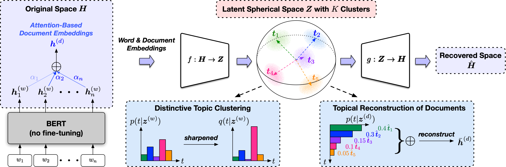

# TopClus

The source code used for [**Topic Discovery via Latent Space Clustering of Pretrained Language Model Representations**](https://arxiv.org/abs/2202.04582), published in WWW 2022.

## Requirements

At least one GPU is required to run the code.

Before running, you need to first install the required packages by typing following commands (Using a virtual environment is recommended):

```
pip3 install -r requirements.txt
```

You need to also download the following resources in NLTK:
```
import nltk
nltk.download('stopwords')
nltk.download('averaged_perceptron_tagger')
nltk.download('universal_tagset')
```

## Overview

**TopClus** is an unsupervised topic discovery method that jointly models words, documents and topics in a latent spherical space derived from pretrained language model representations.

</img>

## Running Topic Discovery

The entry script is [`src/trainer.py`](src/trainer.py) and the meanings of the command line arguments will be displayed upon typing
```
python src/trainer.py -h
```
The topic discovery results will be written to `results_${dataset}`.

We provide two example scripts [`nyt.sh`](nyt.sh) and [`yelp.sh`](yelp.sh) for running topic discovery on the New York Times and the Yelp Review corpora used in the paper, respectively. You need to first extract the text files from the `.tar.gz` tarball files under [`datasets/nyt`](datasets/nyt) and [`datasets/yelp`](datasets/yelp).

You could expect to obtain results like the following (the Topic IDs are random):
```
On New York Times:
Topic 20: months,weeks,days,decades,years,hours,decade,seconds,moments,minutes
Topic 28: weapons,missiles,missile,nuclear,grenades,explosions,explosives,launcher,bombs,bombing
Topic 30: healthcare,medical,medicine,physicians,patients,health,hospitals,bandages,medication,physician
Topic 41: economic,commercially,economy,business,industrial,industry,market,consumer,trade,commerce
Topic 46: senate,senator,congressional,legislators,legislatures,ministry,legislature,minister,ministerial,parliament
Topic 72: government,administration,governments,administrations,mayor,gubernatorial,mayoral,mayors,public,governor
Topic 77: aircraft,airline,airplane,airlines,voyage,airplanes,aviation,planes,spacecraft,flights
Topic 88: baseman,outfielder,baseball,innings,pitchers,softball,inning,basketball,shortstop,pitcher
```
```
On Yelp Review:
Topic 1: steamed,roasted,fried,shredded,seasoned,sliced,frozen,baked,canned,glazed
Topic 15: nice,cozy,elegant,polite,charming,relaxing,enjoyable,pleasant,helpful,luxurious
Topic 16: spicy,fresh,creamy,stale,bland,salty,fluffy,greasy,moist,cold
Topic 17: flavor,texture,flavors,taste,quality,smells,tastes,flavour,scent,ingredients
Topic 20: japanese,german,australian,moroccan,russian,greece,italian,greek,asian,
Topic 40: drinks,beers,beer,wine,beverages,alcohol,beverage,vodka,champagne,wines
Topic 55: horrible,terrible,shitty,awful,dreadful,worst,worse,disgusting,filthy,rotten
Topic 75: strawberry,berry,onion,peppers,tomato,onions,potatoes,vegetable,mustard,garlic
```

## Running Document Clustering

The latent document embeddings will be saved to `results_${dataset}/latent_doc_emb.pt` which can be used as features to clustering algorithms (e.g., K-Means).

If you have ground truth document labels, you could obtain the document clustering evaluation results by passing the document label file and the saved latent document embedding file to the `cluster_eval` function in [`src/utils.py`](src/utils.py). For example:
```
from src.utils import TopClusUtils
utils = TopClusUtils()
utils.cluster_eval(label_path="datasets/nyt/label_topic.txt", emb_path="results_nyt/latent_doc_emb.pt")
```

## Running on New Datasets
To execute the code on a new dataset, you need to 

1. Create a directory named ```your_dataset``` under ```datasets```.
2. Prepare a text corpus ```texts.txt``` (one document per line) under ```your_dataset``` as the target corpus for topic discovery.
3. Run [`src/trainer.py`](src/trainer.py) with appropriate command line arguments (the default values are usually good start points).

## Citations

Please cite the following paper if you find the code helpful for your research.
```
@inproceedings{meng2022topic,
  title={Topic Discovery via Latent Space Clustering of Pretrained Language Model Representations},
  author={Meng, Yu and Zhang, Yunyi and Huang, Jiaxin and Zhang, Yu and Han, Jiawei},
  booktitle={The Web Conference},
  year={2022},
}
```
